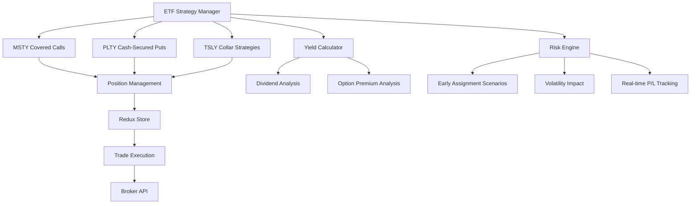

# ETF Strategy Implementation Plan (World 6)

## Overview
Comprehensive support for 3 ETF income strategies:
- **MSTY**: Covered calls position management
- **PLTY**: Cash-secured put campaigns
- **TSLY**: Collar strategies with protective puts

## Architecture


## Specifications

### Redux Actions/Thunks
```typescript
// New action types
const EXECUTE_ETF_STRATEGY = 'trade/executeETFStrategy';
const MANAGE_ETF_POSITION = 'trade/manageETFPosition';
const UPDATE_POSITION_PL = 'portfolio/updatePositionPL';

// ETF Strategy Payload
interface ETFStrategyPayload {
  symbol: string;
  strategyType: 'coveredCall' | 'cashSecuredPut' | 'collar';
  legs: OptionLeg[];
  dividendDates: string[];
  riskParams: RiskParams;
}

// New thunk for ETF strategy execution
export const executeETFStrategy = createAsyncThunk(
  EXECUTE_ETF_STRATEGY,
  async (payload: ETFStrategyPayload, { dispatch }) => {
    // Strategy-specific execution logic
  }
);

// New thunk for real-time P/L updates
export const updatePositionProfitLoss = createAsyncThunk(
  UPDATE_POSITION_PL,
  async (positionId: string, { getState, dispatch }) => {
    const position = selectPositionById(getState(), positionId);
    const pl = await calculatePositionProfitLoss(position);
    return { positionId, pl };
  }
);
```

### Calculation Formulas
**Yield Comparison Model**:
```
Enhanced Yield = (Option Premiums + Dividend Yield) / ETF Price
Benchmark Yield = (Dividend Yield) / ETF Price
Delta = Enhanced Yield - Benchmark Yield

Risk-Adjusted Return = (Enhanced Yield) / (Margin Requirement * Volatility Factor)

**Real-time P/L**:
Position P/L = (Current Price - Entry Price) × Quantity
  + Σ(Option Premiums)
  - Σ(Option Commissions)
```

### Risk Metrics
| Metric | Formula | Description |
|--------|---------|-------------|
| Dividend Risk | `(Days to Ex-Div) * (Div Amount)` | Exposure to dividend dates |
| Assignment Probability | `1 / (Strike - Current Price)` | Likelihood of early assignment |
| Volatility Impact | `Margin Req * (VIX / 20)` | Margin requirement during volatility spikes |
| Position P/L | `(Current Price - Entry Price) × Quantity + Option Premiums` | Real-time profit/loss |

## Test Cases

### Early Assignment Scenarios
```gherkin
Scenario: Early assignment of covered call
  Given MSTY price rises 20% above strike
  When Ex-dividend date is 2 days away
  Then System should trigger assignment warning
  And Suggest roll-up strategy
```

### Real-time P/L Tracking
```gherkin
Scenario: P/L updates on market price changes
  Given active MSTY covered call position
  When underlying price increases by 5%
  Then P/L should reflect stock appreciation
  And Call option value should decrease
  And Net P/L should update accordingly
```
### Volatility Spikes
```gherkin
Scenario: Margin requirement during volatility spike
  Given VIX > 40
  When Managing TSLY collar position
  Then System should recalculate margin hourly
  And Trigger rebalancing if maintenance margin exceeded
```


## Implementation Roadmap

1. **Phase 1**: Core Strategy Implementation (2 weeks)
   - Add new ETF strategy types to MarginService
   - Implement yield comparison calculator
   - Create position management thunks

2. **Phase 2**: Risk Engine Integration (1 week)
   - Add volatility-based margin adjustments
   - Implement dividend date monitoring
   - Create early assignment probability model
   - Implement margin utilization tracking (COMPLETED)

3. **Phase 3**: Testing & Validation (1 week)
   - Backtest with historical ETF data
   - Stress test under volatility scenarios
   - Validate margin calculations
   - Implement real-time P/L tracking
   - Complete yield comparison metrics
   - Implement risk metric calculations (Delta, Theta, Vega)

4. **Phase 4**: Frontend Implementation (1 week)
   - [x] Create ETFStrategyBuilder component
   - [x] Connect component to Redux store
   - [ ] Implement position modification controls (placeholder added)
   - [ ] Add IRR vs dividend yield chart
   - [ ] Add 3% yield progress indicator