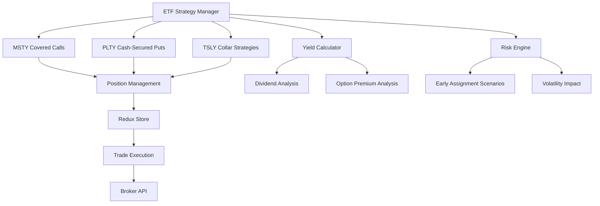

# ETF Strategy Implementation Plan (World 6)

## Overview
Comprehensive support for 3 ETF income strategies:
- **MSTY**: Covered calls position management
- **PLTY**: Cash-secured put campaigns
- **TSLY**: Collar strategies with protective puts

## Architecture


## Specifications

### Redux Actions/Thunks
```typescript
// New action types
const EXECUTE_ETF_STRATEGY = 'trade/executeETFStrategy';
const MANAGE_ETF_POSITION = 'trade/manageETFPosition';

// ETF Strategy Payload
interface ETFStrategyPayload {
  symbol: string;
  strategyType: 'coveredCall' | 'cashSecuredPut' | 'collar';
  legs: OptionLeg[];
  dividendDates: string[];
  riskParams: RiskParams;
}

// New thunk for ETF strategy execution
export const executeETFStrategy = createAsyncThunk(
  EXECUTE_ETF_STRATEGY,
  async (payload: ETFStrategyPayload, { dispatch }) => {
    // Strategy-specific execution logic
  }
);
```

### Calculation Formulas
**Yield Comparison Model**:
```
Enhanced Yield = (Option Premiums + Dividend Yield) / ETF Price
Benchmark Yield = (Dividend Yield) / ETF Price
Delta = Enhanced Yield - Benchmark Yield

Risk-Adjusted Return = (Enhanced Yield) / (Margin Requirement * Volatility Factor)
```

### Risk Metrics
| Metric | Formula | Description |
|--------|---------|-------------|
| Dividend Risk | `(Days to Ex-Div) * (Div Amount)` | Exposure to dividend dates |
| Assignment Probability | `1 / (Strike - Current Price)` | Likelihood of early assignment |
| Volatility Impact | `Margin Req * (VIX / 20)` | Margin requirement during volatility spikes |

## Test Cases

### Early Assignment Scenarios
```gherkin
Scenario: Early assignment of covered call
  Given MSTY price rises 20% above strike
  When Ex-dividend date is 2 days away
  Then System should trigger assignment warning
  And Suggest roll-up strategy
```

### Dividend Date Impacts
```gherkin
Scenario: Dividend capture strategy
  Given PLTY dividend announcement
  When 5 days before ex-dividend date
  Then System should recommend cash-secured put
  With strike price at 95% of current price
```

### Volatility Spikes
```gherkin
Scenario: Margin requirement during volatility spike
  Given VIX > 40
  When Managing TSLY collar position
  Then System should recalculate margin hourly
  And Trigger rebalancing if maintenance margin exceeded
```

## Implementation Roadmap

1. **Phase 1**: Core Strategy Implementation (2 weeks)
   - Add new ETF strategy types to MarginService
   - Implement yield comparison calculator
   - Create position management thunks

2. **Phase 2**: Risk Engine Integration (1 week)
   - Add volatility-based margin adjustments
   - Implement dividend date monitoring
   - Create early assignment probability model

3. **Phase 3**: Testing & Validation (1 week)
   - Backtest with historical ETF data
   - Stress test under volatility scenarios
   - Validate margin calculations