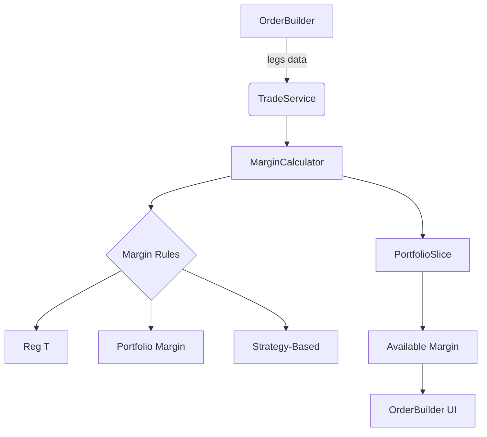

# Margin Calculation Implementation Plan

## 1. Architecture Design


## 2. Implementation Steps

### Phase 1: Core Margin Service
1. **Create `MarginService.ts`**
   - Location: `src/services/MarginService.ts`
   - Responsibilities:
     - Calculate initial/maintenance margin
     - Apply strategy-specific rules
     - Integrate with portfolio value

2. **Margin Rules Implementation**
   ```typescript
   // src/services/MarginService.ts
   export class MarginService {
     static calculateMargin(legs: OptionLeg[], portfolio: PortfolioState): number {
       // Strategy-based margin calculation
       if (isSpread(legs)) return this.calculateSpreadMargin(legs);
       
       // Single leg rules
       return legs.reduce((total, leg) => {
         if (leg.side === 'short') {
           return total + this.calculateNakedMargin(leg);
         }
         return total;
       }, 0);
     }
   }
   ```

### Phase 2: Redux Integration
1. **Update `portfolioSlice.ts`**
   - Add marginUsed field to state
   - Create reducer for updating margin

2. **Modify TradeService**
   - Add margin check before execution:
   ```typescript
   // src/services/TradeService.ts
   const marginRequired = MarginService.calculateMargin(legs, portfolio);
   if (marginRequired > portfolio.availableMargin) {
     throw new Error('Insufficient margin');
   }
   ```

### Phase 3: UI Components
1. **Enhance OrderBuilder**
   - Add real-time margin display
   - Implement margin warning indicators
   ```tsx
   // src/components/OrderBuilder.tsx
   const marginRequired = useSelector(selectMarginRequired);
   return (
     <div className="margin-display">
       Required Margin: ${marginRequired.toFixed(2)}
     </div>
   );
   ```

### Phase 4: Testing
1. **Unit Tests**
   - Margin calculations for all strategy types
   - Error handling for insufficient margin

2. **Integration Tests**
   - Full trade flow with margin validation
   - UI feedback scenarios

## 3. Timeline
```mermaid
gantt
    title Margin Implementation Timeline
    dateFormat  YYYY-MM-DD
    section Core Service
    MarginService.ts       :done, 2025-06-13
    section Redux
    portfolioSlice.ts      :done, 2025-06-13
    TradeService.ts        :done, 2025-06-13
    section UI
    OrderBuilder.tsx       :2025-06-14, 1d
    section Testing
    Unit Tests             :2025-06-15, 1d
    Integration Tests      :2025-06-15, 1d
```

## 4. Risk Mitigation
| Risk | Mitigation Strategy |
|------|---------------------|
| Complex margin rules | Start with Reg T standards, add PM later |
| Performance impact | Memoize calculations, throttle updates |
| State consistency | Atomic updates via Redux |
| Cross-broker rules | Abstract rule configuration |

## 5. Implementation Details
- Core system completed on 2025-06-13
- Extended for ETF strategies on 2025-06-17
- Integrated MarginService into TradeService
- Added stock quote fetching for underlying prices
- Made trade execution async to support quote fetching
- Added margin validation before trade execution
- Updated tradeThunks to handle async execution flow

## 6. ETF Strategy Margin Implementation
### Status
✅ Implemented and tested for all ETF strategies (MSTY, PLTY, TSLY)

### Formulas
- Covered calls: 0 margin required
- Cash-secured puts: Strike * 100 * quantity
- Collars: (Short call strike - Long put strike) * 100 * quantity * dividend risk factor

### Test Results
- ✅ MSTY Covered Call execution and margin
- ✅ PLTY Cash-Secured Put execution and margin
- ✅ TSLY Collar execution and margin
- ✅ Prevent trade with insufficient buying power (TSLY collar)
- ✅ Applies 1.5x dividend risk factor
- ✅ Does not apply dividend risk factor for non-ETFs
- ✅ Uses normal margin when dividend fetch fails
- ✅ Early assignment risk detection

### Risk Factors
- Dividend risk factor: Applied only to ETFs
- Factor = (daysToExDiv <= 5) ? 1.5 : 1.0
- Early assignment warning when:
  - Option is deep ITM (>= $0.50 for calls, <= $0.50 for puts)
  - Days to expiry < 3

## 7. Timeline
```mermaid
gantt
    title Margin Implementation Timeline
    dateFormat  YYYY-MM-DD
    section Core Service
    MarginService.ts       :done, 2025-06-13
    section Redux
    portfolioSlice.ts      :done, 2025-06-13
    TradeService.ts        :done, 2025-06-13
    section UI
    OrderBuilder.tsx       :done, 2025-06-14
    section Testing
    Unit Tests             :done, 2025-06-15
    Integration Tests      :done, 2025-06-15
    section ETF Strategies
    Margin Formulas        :done, 2025-06-17
    Dividend Risk          :done, 2025-06-17
    Test Cases             :done, 2025-06-17
```