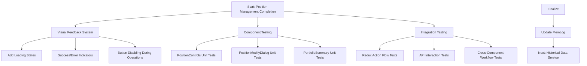

# Position Management Completion Plan

## Objective
Finalize Position Management feature by:
1. Adding visual feedback for operations
2. Completing component and integration tests
3. Updating memlog documentation

## Implementation Details

### 1. Visual Feedback System
- **Loading States**: Add spinners to [`src/components/PositionControls.tsx`](src/components/PositionControls.tsx)
- **Notifications**: Implement react-toastify in [`src/App.tsx`](src/App.tsx)
- **Pending State**: Create `isPending` flag in [`src/redux/portfolioSlice.ts`](src/redux/portfolioSlice.ts)
- **Button States**: Disable buttons during operations in [`src/components/PositionModifyDialog.tsx`](src/components/PositionModifyDialog.tsx)

### 2. Component Testing
- **Test Files**:
  - [`src/components/PositionControls.test.tsx`](src/components/PositionControls.test.tsx)
  - [`src/components/PositionModifyDialog.test.tsx`](src/components/PositionModifyDialog.test.tsx)
  - [`src/components/PortfolioSummary.test.tsx`](src/components/PortfolioSummary.test.tsx)
- **Test Cases**:
  - Loading state rendering
  - Success/error toast triggering
  - Button disable states
  - User interaction simulations

### 3. Integration Testing
- **Cypress Tests**:
  - Position modification workflow
  - Real-time P&L updates
  - Error handling scenarios
- **Mocking**: Use [`src/services/mockApiService.ts`](src/services/mockApiService.ts) for API responses

### 4. MemLog Updates
- **Changelog**: Add completion notes to [`memlog/CHANGELOG.md`](memlog/CHANGELOG.md)
- **Development Plan**: Mark as complete in [`memlog/DEVELOPMENT_PLAN.md`](memlog/DEVELOPMENT_PLAN.md)
- **Issues**: Remove resolved items from [`memlog/ISSUES.md`](memlog/ISSUES.md)

## Next Steps
1. Review this plan
2. Switch to Code mode for implementation
3. Begin with Visual Feedback System implementation