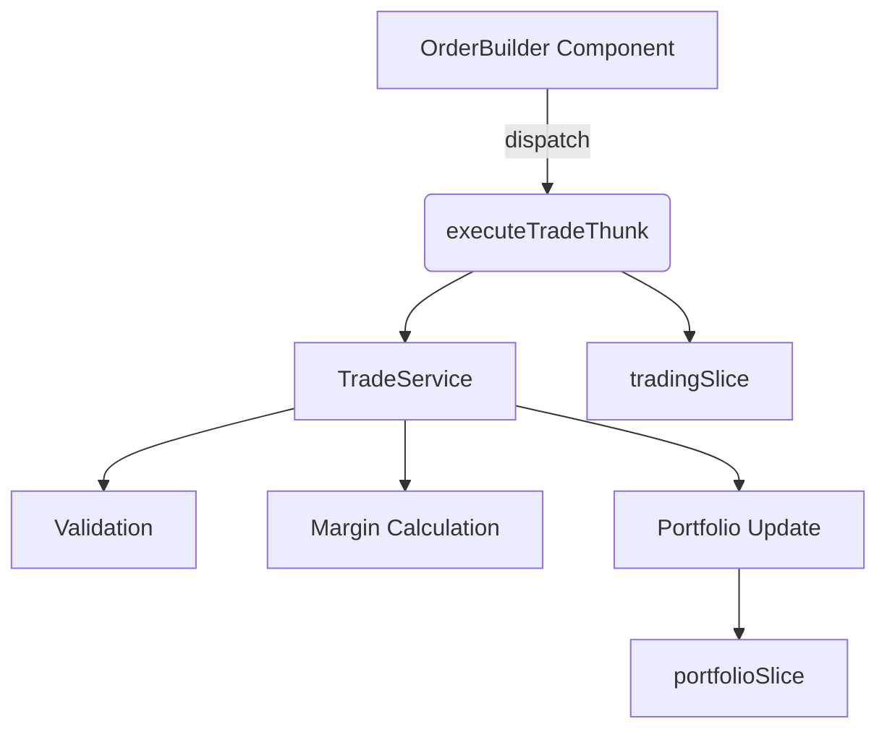
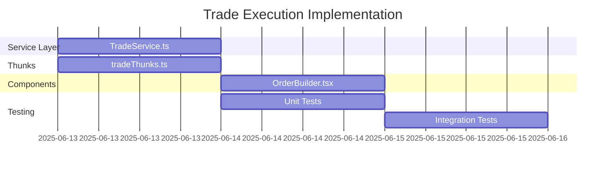

# Trade Execution Implementation Plan

## Architecture Overview


## Phase 1: Service Layer Implementation
1. **Create TradeService**
   - Path: `src/services/TradeService.ts`
   - Responsibilities:
     - Trade validation
     - Margin calculation
     - Portfolio updates
     - Error handling
   - Dependencies:
     - `RootState` from store
     - `addPosition` from portfolioSlice
     - `OptionLeg` interface

2. **Refactor TradingSlice**
   - Remove execution logic from reducer
   - Simplify state management for trade legs
   - Add `executeTrade` action to clear legs after execution

## Phase 2: Thunk Implementation
1. **Create Trade Thunks**
   - Path: `src/redux/tradeThunks.ts`
   - Structure:
     ```typescript
     export const executeTradeThunk = (legs: OptionLeg[]) => 
       (dispatch: AppDispatch, getState: () => RootState) => {
         try {
           TradeService.executeTrade(legs, getState, dispatch);
           dispatch(executeTrade(legs));
         } catch (error) {
           dispatch(setTradeError(error.message));
         }
       }
     ```

2. **Update Store Configuration**
   - Remove deprecated trade middleware
   - Ensure thunk middleware is properly configured

## Phase 3: Component Integration
1. **Update OrderBuilder Component**
   - Path: `src/components/OrderBuilder.tsx`
   - Changes:
     - Replace direct dispatch with executeTradeThunk
     - Add error feedback UI
     - Implement loading state during trade execution

## Phase 4: Testing Strategy
1. **Unit Tests**
   - TradeService validation logic
   - Margin calculation edge cases
   - Thunk success/failure behavior

2. **Integration Tests**
   - Full trade execution flow
   - Portfolio state updates
   - Error handling scenarios
   - UI feedback mechanisms

## Estimated Timeline


## Risk Mitigation
| Risk | Mitigation Strategy |
|------|---------------------|
| Circular Dependencies | Use dependency injection pattern |
| Type Conflicts | Centralize core interfaces in `types/` |
| Performance Issues | Memoize heavy calculations |
| State Inconsistency | Atomic portfolio updates |
| Error Handling | Comprehensive error logging |

## Next Steps
1. Switch to Code mode for implementation
2. Execute Phase 1 (TradeService creation)
3. Verify service-layer functionality
4. Proceed to thunk implementation
### Verification Approach
The integration tests follow a state-based verification approach:
1. Mock dependencies (MarginService, ApiService)
2. Setup representative application state
3. Execute trade through TradeService
4. Verify:
   - Correct portfolio updates
   - Proper error handling
   - Margin validation logic
   - Stock quote fetching behavior

### Test Case Summary
| Scenario | Description | Covered Requirements |
|----------|-------------|----------------------|
| Valid Trade | Successful position creation | TR-EXEC-001, TR-EXEC-002 |
| Invalid Legs | Rejects malformed option legs | TR-EXEC-003 |
| Insufficient Margin | Blocks trades exceeding buying power | TR-EXEC-004 |
| Quote Fetching | Automatically fetches missing stock quotes | TR-EXEC-005 |
| API Errors | Handles failed quote requests | TR-EXEC-006 |
| Margin Calculation | Validates complex option strategies | TR-EXEC-007 |

[View full implementation](../../src/services/__tests__/TradeService.integration.test.ts)